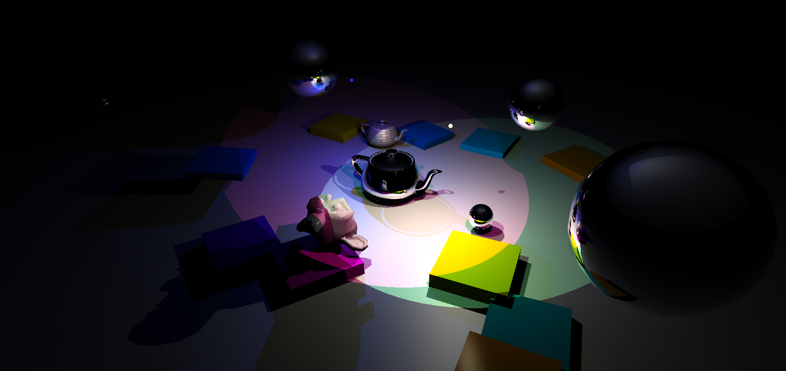

# Rendertool



Assignments for Interactive Computer Graphics and Physics-Based Animation.

## Features
- Variety of lights, shadow mapping
- Interactive rigid body physics
- OBJ format materials, shading

## Assets
Before doing anything you need to download the externally-hosted assets. On Linux you can just run the `download_assets.sh` script. Otherwise, you'll have to [download](http://cs.utah.edu/~benpm/assets.zip) and unzip the archive manually.

## Building

### Linux
You might need to install a couple packages:
- `libxinerama-dev`
- `libglu1-mesa-dev`
- `libxi-dev`
- `ninja-build`

Then let CMake handle the rest:
```bash
cmake -B build
cmake --build build
```

### Windows
Open project as a CMake project, click "Build All", and hope for the best. You might want to install Ninja.

## Running
`./build/app` or `.\build\app.exe`

## Dependencies
These dependencies are either included or managed by CMake and built locally:

- [GLFW](https://github.com/glfw/glfw)
- [eigen](http://eigen.tuxfamily.org)
- [gleq](https://github.com/glfw/gleq)
- [cyCodeBase](http://www.cemyuksel.com/cyCodeBase/code.html)
- [spdlog](https://github.com/gabime/spdlog)
- glad
- [EnTT](https://github.com/skypjack/entt)
- [libspng](https://libspng.org)

## Resources Used
- https://github.com/mikolalysenko/mikolalysenko.github.com/blob/master/Isosurface/js/surfacenets.js