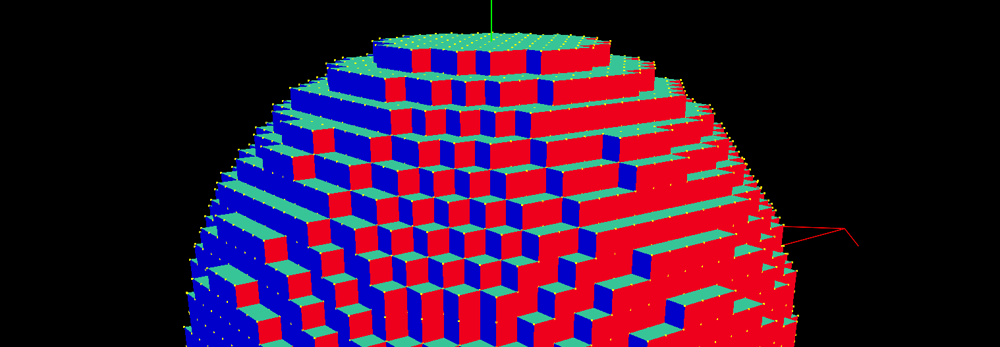

# C6160 Final Report
https://github.com/benpm/CS6610/tree/surfnets

> NOTE: a significant amount of code in this repository is not related to my project. A lot of it is the renderer I wrote during this semester for Interactive Compute Graphics. The code relevant to this project is mostly in `resources/shaders/surface_net.comp` and `src/app.cpp`

This project is a GPU-accelerated implementation of Elastic Surface Nets, a method of creating triangular meshes from volume data.

This method is the topological dual to methods like Marching Cubes - instead of creating vertices along the edges of cells, a single vertex is created per cell. 

## Implementation
1. Check if current cell's voxel is on the surface by checking if it has at least one neighbor that is a different sign than itself.
2. If cell is on surface, place a vertex at a prescribed position. Place the ID of this vertex in the corresponding cell of the index grid.
3. Optionally relax the vertex by iteratively equalizing neighboring edge lengths.
4. Create quads by checking neighboring voxels along each axis. If the neighbor is a different sign, we place a quad along that direction.

Simply creating a vertex per cell produces blocky geometry:

In order to produce something smoother, I tried two approaches. The first is to place the vertices at the average position between the current cell and its neighbors:

After generating these vertices, I relax the surface by iteratively moving every vertex towards its connected neighbor vertices:

This method produces a very high degree of instability when the voxel data is dynamic. This instability is likely due to some bad memory access which I haven't been able to track down. It also produces a pinching effect, creating very thin and small triangles, which is not ideal.

The second approach is a method for smooth surface geometry outlined by Mikola Lysenko called Naive Surface Nets. This method involves using trilinear filtering to place vertices at the average of the zero crossings along each cube edge. Unfortunately I haven't had time to fix my implementation.

## Challenges
In order to parallelize this algorithm successfully in a compute shader, some issues had to be addressed. Most of these issues came down to memory coherency Since the compute shader spawns one thread per voxel, memory dependency between cells must be accounted for. Since theres's no guarantee adjacent cells will have created a vertex before their neighbors, memory barriers had to be used to ensure synchronization at specific points in the process. This ended up changing the flow of the algorithm a fair amount, and made debugging quite a challenge.

## Further Work
There are many places in the code that could be heavily optimized. One significant example is that of occupancy: only one thread per work group is used, which leads to a huge amount of wasted work on the GPU.

## References
- https://0fps.net/2012/07/12/smooth-voxel-terrain-part-2/
- https://www.merl.com/publications/docs/TR99-24.pdf