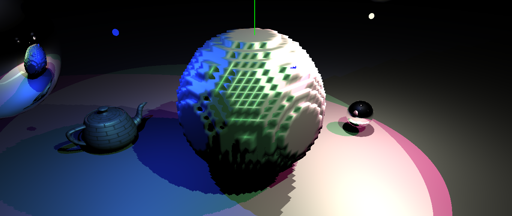

# C6160 Mid-project Report

> Question 1: Write a paragraph providing detail about the status of the development and experimentation/demonstration.

I've started implementing Constrained Elastic Surface Nets in C++. It's being rendered using a renderer I'd previously written. The first step to surface nets is to generate a cubic mesh, which is what I've implemented on the CPU. I've implemented this step in a highly independent way so that it should be easily parallelized in a compute shader. My next task is to implement some form of vertex relaxation, which is actually entirely independent such should also easily be ported to a compute shader.

The relevant code for this project can be found in `src/surface_net.cpp`

> Question 2: Provide a detailed description of any changes in the scope of your project. If there are no scope changes, please note 'No changes in scope.'

No changes in scope