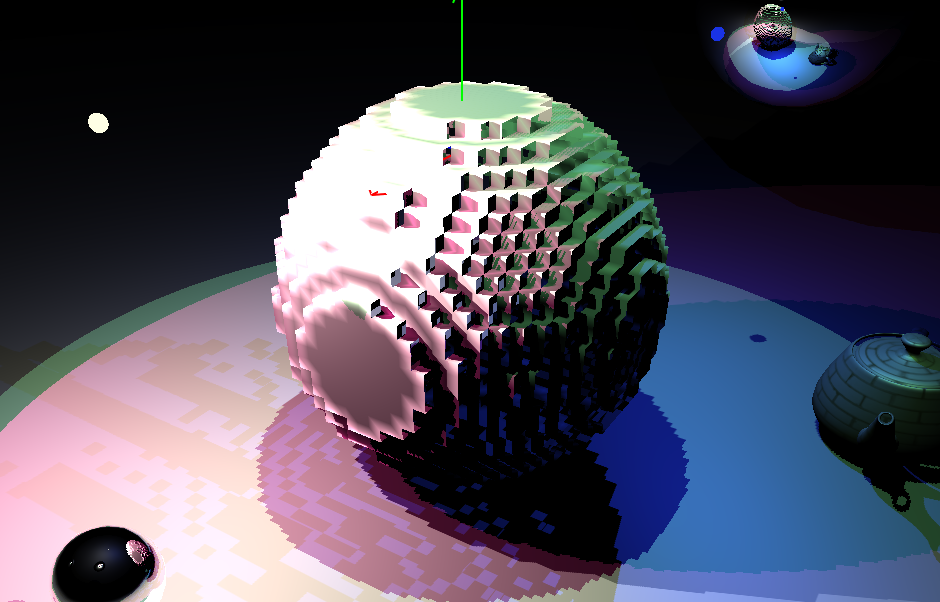

# C6160 Mid-project Report

> Question 1: Write a paragraph providing detail about the status of the development and experimentation/demonstration.

I've started implementing Constrained Elastic Surface Nets in C++ in my renderer I wrote for Interactive Computer Graphics. I've managed to get the basic cubic mesh generation working, but there is a problem.

> Question 2: Provide a detailed description of any changes in the scope of your project. If there are no scope changes, please note 'No changes in scope.'