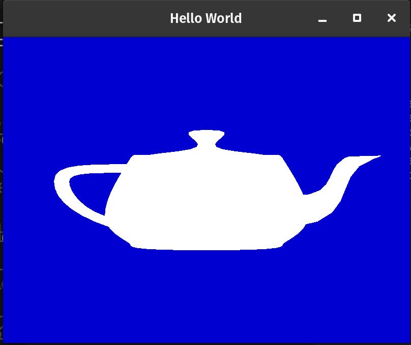

# CS 6610 Project 1

- What you implemented

A window is created and draws a simple teapot (one line of code with FreeGLUT). The background shifts color over time.

- What you could not implement

N/A

- Additional functionalities beyond project requirements

A teapot

- How to use your implementation

Just build and run. On Windows, it can be built by opening the directory as a CMake project in Visual Studio and hitting "Build All". You might need to copy a DLL file into the directory with the executable.

- What operating system and compiler you used

Linux, GCC

- External libraries and additional requirements to compile your project

Using FreeGLUT and glm, both are pulled and built through the CMake config. I also had to install `libglu1-mesa-dev` and `libxi-dev` on Linux to get FreeGLUT to build, but that shouldn't be a problem on Windows.
