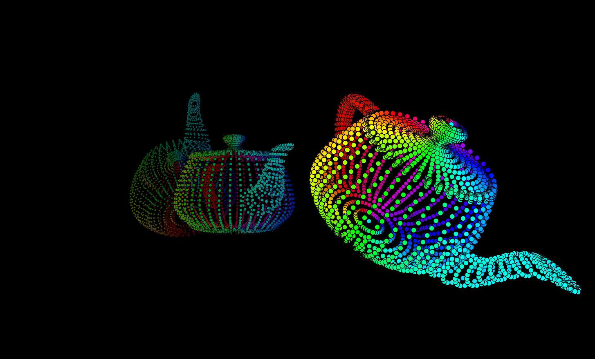

# CS 6610 Project 2
*Benjamin Mastripolito u1419419*

"Here is my handle, here is my spout..."

> What you implemented

Multiple teapots are rendered in points mode. Orbiting camera can be moved with left click for orbit movement, right click or mouse wheel for zoom. Teapot mesh bounds are used to compute a "pivot" point which is used to center the model. Pressing P will switch camera projection mode, and pressing F6 will recompile shader program.

> What you could not implement

All requirements are implemented, although I did have a couple more things planned that I didn't get around to:
- Middle click to pan camera target point
- Passing model transforms via UBOs

> Additional functionalities beyond project requirements

- Multiple teapots
- Points are rendered as outlined circles instead of squares. Their size changes by distance from camera
- Vertex colors to make teapots more fun to look at

> How to use your implementation

- Windows:
  - requires CMake, Ninja, MSVC redistributable / Visual Studio
  - `.\build_windows.bat`
  - `.\app.exe`
- Linux:
  - `cmake -Bbuild`
  - `cmake --build build`
  - `./build/app`

> What operating system and compiler you used

Linux, GCC

> External libraries and additional requirements to compile your project

- [GLFW](https://github.com/glfw/glfw) - window management
- [eigen](http://eigen.tuxfamily.org) - math
- [gleq](https://github.com/glfw/gleq) - event handling
- [cyCodeBase](http://www.cemyuksel.com/cyCodeBase/code.html) - various
- [spdlog](https://github.com/gabime/spdlog) - logging
- glad - OpenGL extensions

GLFW, Gleq, Eigen, and spdlog are pulled and built by CMake.
