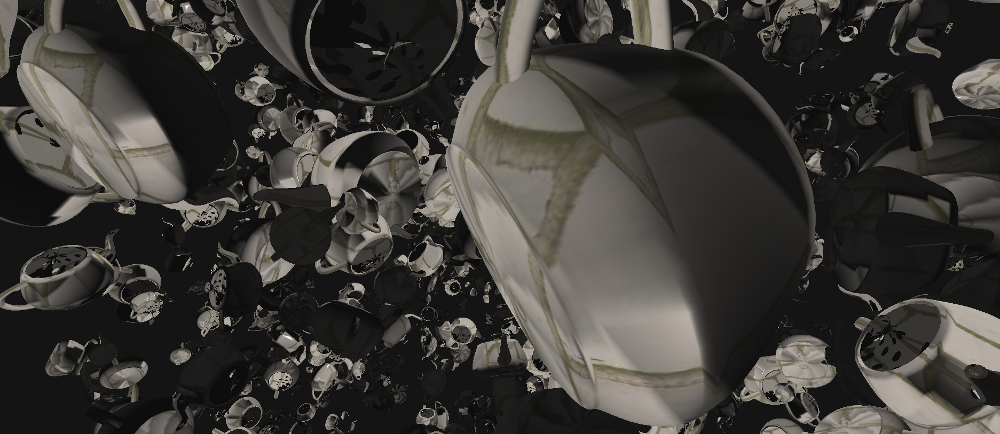

# CS 6610 Project 4
*Benjamin Mastripolito u1419419*

> What you implemented

- Textures

> What you could not implement

- Specular

> Additional functionalities beyond project requirements

> How to use your implementation

- Windows:
  - Open in Visual Studio, Build All
  - app.exe output to top directory
- Linux:
  - `cmake -Bbuild`
  - `cmake --build build`
  - `./build/app`

> What operating system and compiler you used

Linux, GCC

> External libraries and additional requirements to compile your project

- [GLFW](https://github.com/glfw/glfw) - window management
- [eigen](http://eigen.tuxfamily.org) - math
- [gleq](https://github.com/glfw/gleq) - event handling
- [cyCodeBase](http://www.cemyuksel.com/cyCodeBase/code.html) - various
- [spdlog](https://github.com/gabime/spdlog) - logging
- glad - OpenGL extensions

GLFW, Gleq, Eigen, and spdlog are pulled and built by CMake.
