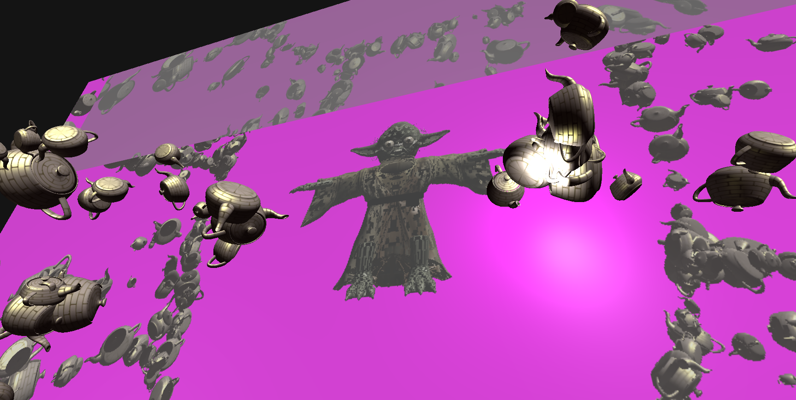
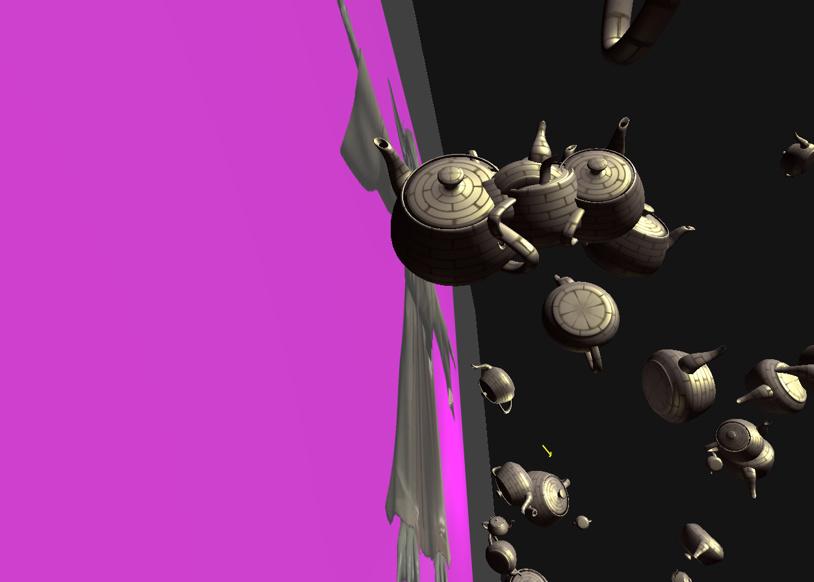

# CS 6610 Project 5
*Benjamin Mastripolito u1419419*

*"Witness me"*

> What you implemented

- Rendering to a texture
- Two cameras, one can be controlled with ALT + click
- Pass model argument with `-m` option
- Bilinear filtering for mag, mip-mapped with anistropic for min (see `src/app.cpp:122`)

> What you could not implement

N/A

> Additional functionalities beyond project requirements

- Multiple material / texture models

> How to use your implementation

- Windows:
  - Open in Visual Studio, Build All
  - app.exe output to top directory
- Linux:
  - `cmake -Bbuild`
  - `cmake --build build`
  - `./build/app`

CLI options:
- `-m`, `--model`: Path to model to load and show
- `-h`, `--help`: Show help

> What operating system and compiler you used

Linux, GCC

> External libraries and additional requirements to compile your project

- [GLFW](https://github.com/glfw/glfw) - window management
- [eigen](http://eigen.tuxfamily.org) - math
- [gleq](https://github.com/glfw/gleq) - event handling
- [cyCodeBase](http://www.cemyuksel.com/cyCodeBase/code.html) - various
- [spdlog](https://github.com/gabime/spdlog) - logging
- glad - OpenGL extensions

GLFW, Gleq, Eigen, and spdlog are pulled and built by CMake.
