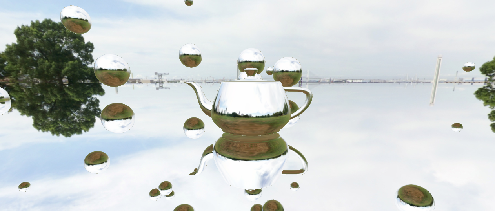
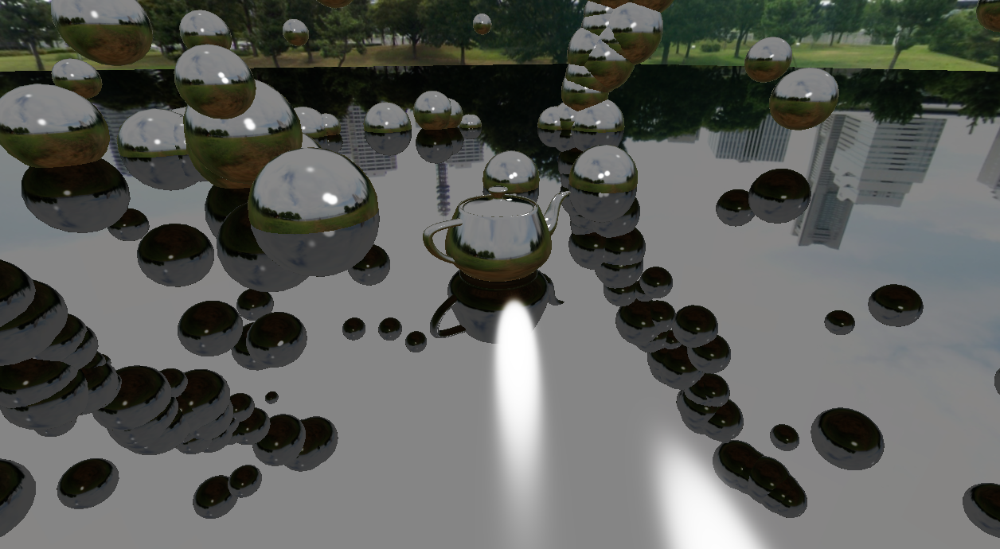

# CS 6610 Project 6
*Benjamin Mastripolito u1419419*

*Just reflection*

*Blending with other shading*

> What you implemented

- Environment mapping
- Environment reflections
- Blending with other shading factors
- Phony planar reflections by rendering with flipped camera

> What you could not implement

N/A

> Additional functionalities beyond project requirements

- Per-object rendered environment maps

> How to use your implementation

- Windows:
  - Open in Visual Studio, Build All
  - app.exe output to top directory
- Linux:
  - `cmake -Bbuild`
  - `cmake --build build`
  - `./build/app`

CLI options:
- `-m`, `--model`: Path to model to load and show
- `-h`, `--help`: Show help

> What operating system and compiler you used

Linux, GCC

> External libraries and additional requirements to compile your project

- [GLFW](https://github.com/glfw/glfw)
- [eigen](http://eigen.tuxfamily.org)
- [gleq](https://github.com/glfw/gleq)
- [cyCodeBase](http://www.cemyuksel.com/cyCodeBase/code.html)
- [spdlog](https://github.com/gabime/spdlog)
- glad
- [EnTT](https://github.com/skypjack/entt)
- [libspng](https://libspng.org)

Most of these are pulled and built by CMake.
