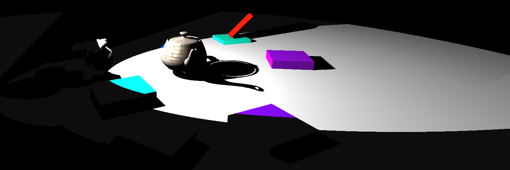

# CS 6610 Project 7
*Benjamin Mastripolito u1419419*

> What you implemented

- Spot light shadows
- Control spot light orientation with shift + left click
- Lights use Cem's trick for smoothing out light falloff

> What you could not implement

- The spotlight projection might be a little wrong
- Support for multiple shadow-casting lights (beyond the single point light and spot light)
- Directional light shadows

> Additional functionalities beyond project requirements

- Point light shadows

> How to use your implementation

- Windows:
  - Open in Visual Studio, Build All
  - app.exe output to top directory
- Linux:
  - `cmake -Bbuild`
  - `cmake --build build`
  - `./build/app`

CLI options:
- `-m`, `--model`: Path to model to load and show
- `-h`, `--help`: Show help

> What operating system and compiler you used

Linux, GCC

> External libraries and additional requirements to compile your project

- [GLFW](https://github.com/glfw/glfw)
- [eigen](http://eigen.tuxfamily.org)
- [gleq](https://github.com/glfw/gleq)
- [cyCodeBase](http://www.cemyuksel.com/cyCodeBase/code.html)
- [spdlog](https://github.com/gabime/spdlog)
- glad
- [EnTT](https://github.com/skypjack/entt)
- [libspng](https://libspng.org)

Most of these are pulled and built by CMake.

