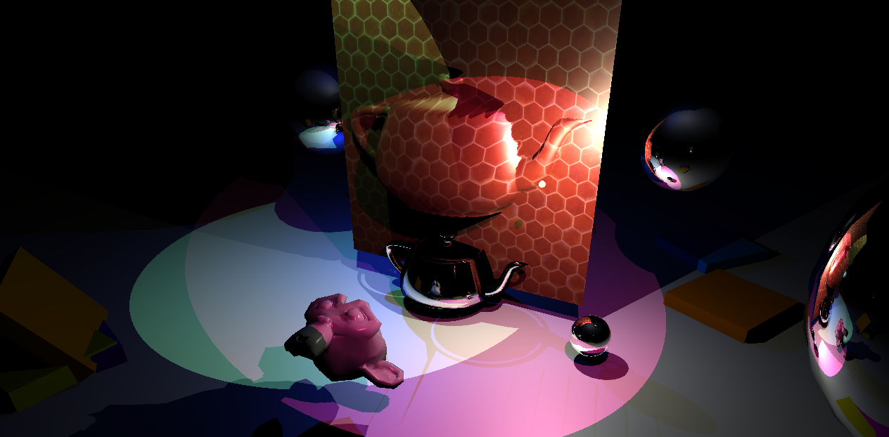
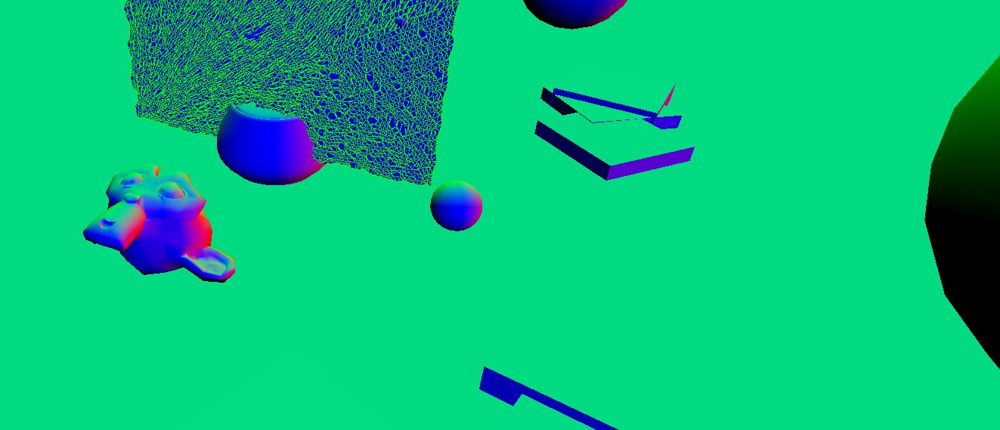
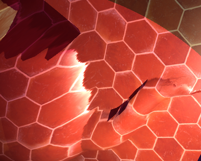
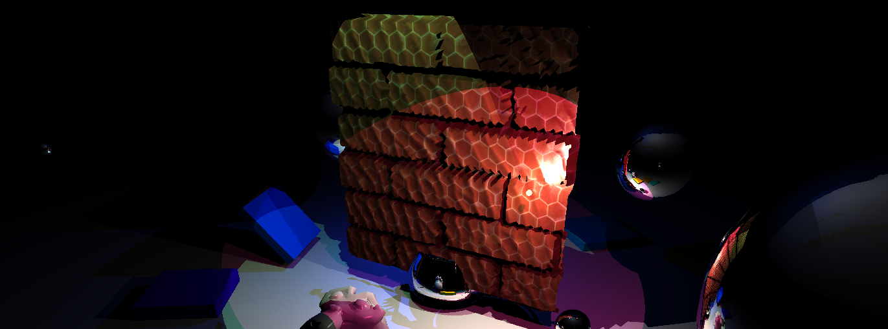

# CS 6610 Project 7

> What you implemented
- Displacement mapping using a tessellation shaders
- Normal mapping
- Tessellation implemented within wireframe, shadow depth, and default shader programs
- Command-line arguments
- Wireframe program that shows outlines

> What you could not implement

N/A

> Additional functionalities beyond project requirements

Combined with everything else

> How to use your implementation

- Windows:
  - Open in Visual Studio, Build All
  - app.exe output to top directory
- Linux:
  - `cmake -Bbuild`
  - `cmake --build build`
  - `./build/app`

`./app [normal map] [displacement map]`

> What operating system and compiler you used

Linux, GCC

> External libraries and additional requirements to compile your project

- [GLFW](https://github.com/glfw/glfw)
- [eigen](http://eigen.tuxfamily.org)
- [gleq](https://github.com/glfw/gleq)
- [cyCodeBase](http://www.cemyuksel.com/cyCodeBase/code.html)
- [spdlog](https://github.com/gabime/spdlog)
- glad
- [EnTT](https://github.com/skypjack/entt)
- [libspng](https://libspng.org)

Most of these are pulled and built by CMake.